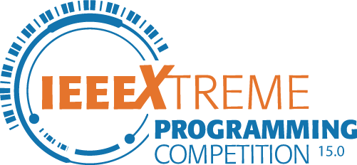

  

# IEEEXtreme 16.0 Solutions

Welcome to the IEEEXtreme 15.0 Solutions repository! This collection contains my solutions to the problems presented in the IEEEXtreme 15.0 programming competition, all written in Python. Each folder corresponds to a specific problem and includes both the problem statement (PDF) and my solution.

## Problems Solved
